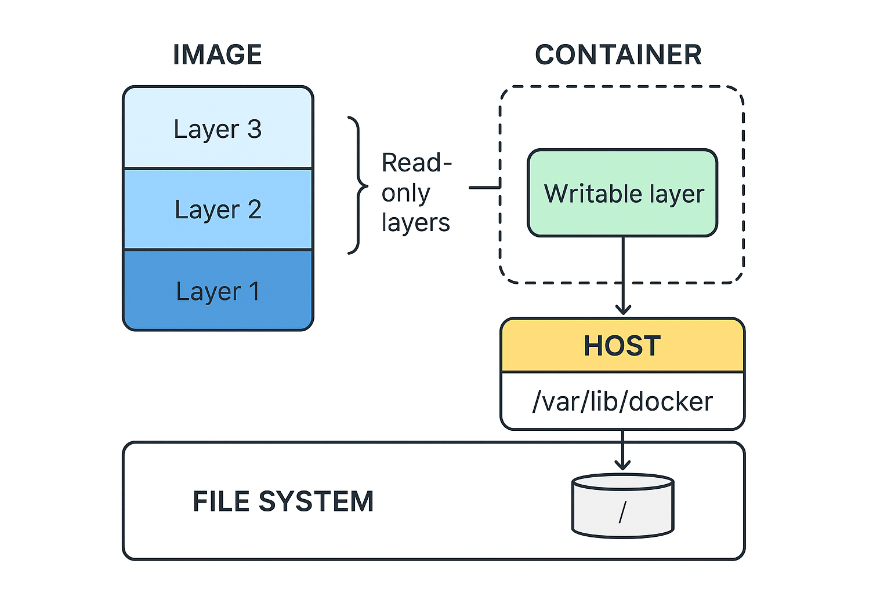

# Docker
Official docs at: https://docs.docker.com/get-started/docker-overview/

## Introduction
Docker is a platform that allows developers and teams to create, test, ship and run applications. It accomplishes this by packaging an application and all its dependencies (like libraries, runtimes or even an OS) into a single, isolated unity called a <b>Container</b>.

A <b>Container</b> is an isolated environment, but it runs inside the OS's own kernel. This is quite different than a Virtual Machine, that would allocate resources from its host and create a whole virtualization of the hardware, with a new kernel and isolated processes. Althought you can achieve this isolate with both of approaches using containers offers advatanges, like a lightweight environment and a fast startup, which can reduce the massive overhead from virtualization, especially for a large amount of apps.

Docker uses linux features, such as <i>namespaces</i>, <i>control groups</i> and <i>OverlayFS</i> to achieve isolation, resource management and file sharing efficiency without creating a new OS. Because this isolation is created with an environment that can be reproduced and shared developers can create, test and ship applications much more consistently, avoiding compatibility issues, for example running the same Java app with JDK17 in on machine, and JDK25 in another.

## Components
Docker provides several tools to manage the life cycle of containers:

* <b>Docker Engine: </b> is the core service that builds, runs and manages containers, it runs natively on linux. 
* <b>Docker CLI: </b>  command line interface for interacting with docker engine
* <b>Docker Desktop: </b> a GUI interface (bundled with docker engine) for managing images and running containers, used primarily by systems that don't have linux's kernel features.
* <b>Docker Hub: </b> public registry to pull built images remotely.
* <b>Dockerfile: </b> script created by the developers with step-by-step instructions on how to create and run an image
* <b>Image: </b> build from a dockerfile, it's a read-only template used to create and run the containers. They can be shared with other teams or developers.
* <b>Container: </b> it's the isolated, running instance of an image.

## Building images
Images are built from a script, the dockerfile. An image is built with <b>layers</b> stacked upon each other, like the following image:



When you write a dockerfile you can run different instructions, and most of them create a new layer. If you use a layer 
in more than one container docker might cache them and just share the binaries with all containers that ask for it, provided the layer doesn't change its state upon every rebuild process.

To demonstrate how <b>layer caching</b> works consider the following where a dockerfile creates a container for an angular development environment:

```dockerfile
# Bad layer caching example

FROM node:22-alpine # layer 1

WORKDIR /angular-app # layer 2

COPY . /angular_app # layer 3

RUN npm install -g @angular/cli # layer 4

RUN npm install # layer 5

EXPOSE 4200

CMD ["ng", "serve", "--host", "0.0.0.0", "--port", "4200"]
```

The image above has 5 layers and docker will cache all of them, so every single time you build the image again docker just uses the cached layer. The story is different each time a change in any of them occurs. If this happens docker will rebuild the changed layer and <b>ALL</b> layer below it. So the order of commands in a dockerfile is important, as you should place rarely changed layers at the the top of the file and ever changing ones in at bottom whenever possible. The example above is bad example because during development the source code changes constantly, so `layer 3` needs to be rebuilt every time along with layers 4 and 5 (which is expensive to build).

The next dockerfile breaks layer caching much later:

```dockerfile file
# Good layer caching example

FROM node:22-alpine # layer 1

WORKDIR /angular-app # layer 2

RUN npm install -g @angular/cli # later 3

COPY .package.json .package-lock.json /angular-app # layer 4

RUN npm install # layer 5

COPY . /angular_app # layer 6

EXPOSE 4200

CMD ["ng", "serve", "--host", "0.0.0.0", "--port", "4200"]
```

Because dependencies don't change as often, it's much more efficient to put them at the top of the file. In the example above only layer `layer 6` changes, compared to three layers in the previous example. 

Once all layers are provided and the container runs, a single filesystem is created with all layers combined into a single mounted unit. Docker provides commands for accessing this filesystem, where you can run standard linux commands if you built an image with a linux distro, for example.  

You can modify the container's data inside a <b>writable layer</b>, which is deleted once the container shuts down. The image itself is static and immutable, which is necessary to share stateless environments to other users.

### Context
When you build an image from a dockerfile you need to inform the docker daemon where the files for COPY (and other commands as well) are. This is done by passing a path knonwn as <b>context</b>, for example:

```bash
sudo docker build -t sometag -f <path-to-docker-file> <context-path>
```
Because the daemon cannot see any files above or outside of the context you should set it as the root of the application or, at least, as down as possible within the file tree. Note any paths specified within a dockerfile must use the context path as the root.